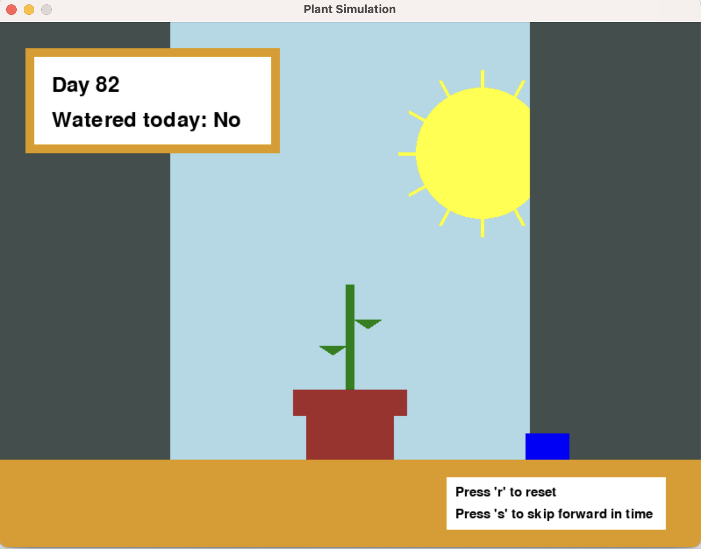

# COMS3930 Module 2: Sensors and WebSerial Project

## Grow Your Own Pixel Plant

**Description:**
A game that simulates a virtual plant, whose conditions are affected by 2 factors: whether the user has watered the plant, and whether there is an optimal level of light for the plant. Hardware components provide interactable controls for the factors - a button allows the user to water the plant, and a potentiometer toggle alows the user to adjust curtains in the background of the game as proxy for changing the lighting for the plant. 

**Hardware Materials:**
* TTGO T1 board with built-in ESP32 microcontroller
* Potentiometer Toggle
* Button
* Breadboard
* Male-to-female wires
* USB-C to USB-C cable 
* Laptop with USB-C port

**Enclosure materials:**
* Cardboard Box - to be used as an enclosure
* Electric Tape
* Markers, Pen, Pencil
* X-acto knife

**Process:** 
1. Align the TTGO T1 board with the breadboard so that each pin corresponds with its own row on the breadboard. Gently insert the TTGO board into the breadboard.
2. Use the Male-to-Female wires to connect the button and potentiometer to the breadboard, thereby connecting the button and potentiometer to the TTGO T1.
     - For the button, notice that there are 4 prongs on the button, but the 4 are paired into 2 pairs:
         - Connect one prong from the other pair to a ground pin.
         - Connect one prong from one pair to a GPIO pin on the TTGO T1 (again, via breadboard). Note the pin number.
      
            

     - For the potentiometer, notice that there are 3 prongs in a line:
         - Connect one outer prong to the 3V pin.
         - Connect the other outer prong to a ground pin.
         - Connect the middle prong to a GPIO pin. Note the pin number.
      
            

     - Note the components are pictured separately, but both need to be connected to the board. 

4. Connect TTGO T1 board to laptop via USB-C to USB-C cable. Set up Arduino IDE by selecting “TTGO T1” for board and the correct USB-C port.
5. Develop program in Arduino IDE that reads in the serial input from the button and potentiometer. Ensure you've written the correct pins numbers. Program _serial_reading.ino_ found in repo.
6. Upload code to device.
7. Develop game program in Python using Pygame library. Ensure you establish a serial connection with the correct USB-C port (same port from step 3). Example code: `ser = serial.Serial('/dev/cu.usbserial-56230075411', 115200, timeout=1)` Program _flowergame.py_ found in repo.

Now to make the enclosure!

7. First, secure basically everything using electric tape. Secure where wires connect to components, and where wires connect to the breadboard. 
8. The breadboard and TTGO T1 board will be hidden inside the enclosure, so we have to make sure there are holes for any outfacing/out-going components.
      - Using a pencil, trace the outlines of the button and the potentiometer onto the front of the cardboard box. Carve out the outlines with an X-acto knife.
      - Also carve out a small hole in the back of the box for the USB-C to USB-C cable. 
9. Stick the breadboard and TTGO into the enclosure and secure to the bottom of box. Push the button and potentiometer into their corresponding holes and tape from within. Push USB-C cable through the hole in the back.

     Inside:
   
     

     Front:
   
    

    Back:
   
    
   
10. Decorate the box with markers. Be sure to label the button and potentiometer. For the potentiometer, it's important to note at what point the curtain is fully closed, and at what point it is fully open.
11. Now to run the game! First, ensure the Arduino code has been flashed to the TTGO T1 board. Then, close the application to ensure the port is not busy. Finally, run the Python program, and the following screen should pop up. Now you can start taking care of your plant!

    
